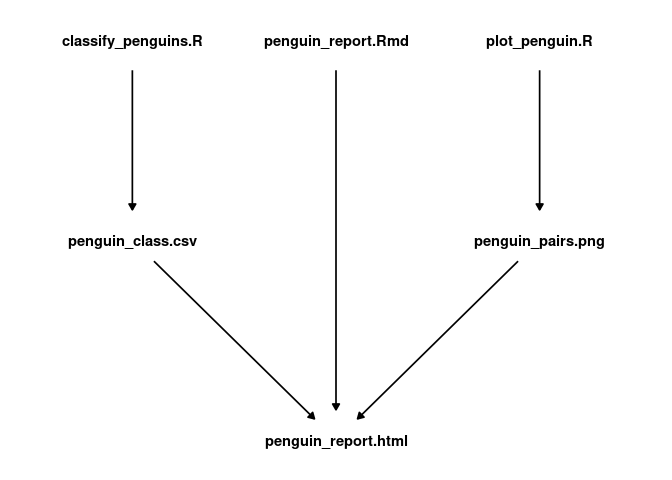

Simple practice for creating a makefile using Palmer penguins data
================
David Gerard

<!-- README.md is generated from README.Rmd. Please edit that file -->

## Introduction

This is a simple exercise for creating a makefile to manager a small
project that examines the really cool [Palmer Penguins
data](https://allisonhorst.github.io/palmerpenguins/).

The files in the final report are:

  - Makefile
  - Readme.Rmd
  - Readme.md
  - analysis
      - classify\_penguins.R
      - penguin\_report.html
      - penguin\_report.Rmd
      - plot\_penguin.R
  - output
      - penguin\_class.csv
      - penguin\_pairs.png

These files have the following dependency structure:

<!-- -->

# Instructions

0.  Make sure you have the necessary R packages installed:
    
    ``` r
    library(tidyverse)
    library(tidymodels)
    library(GGally)
    library(palmerpenguins)
    ```

1.  Modify the Makefile to automatically manage this pipeline.

2.  Run `make` in the terminal to generate all of the output
    (penguin\_class.csv, penguin\_pairs.png, and penguin\_report.html)

3.  Change the color scheme in the pairs plot and re-run `make`.

4.  Correct the date field in the YAML header in “penguin\_report.html”
    and re-run `make`
